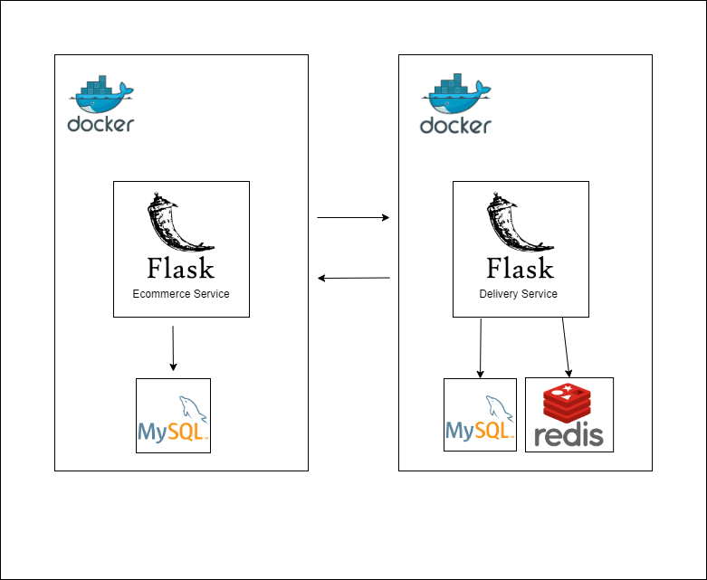

# Test Ecommerce and Delivery Service 

## Structure 

| Codebase                               |   Description      |
| :------------------------------------: | :--------------:   |
| [delivery-service](delivery-service)   | Flask - Service    |
| [ecommerce-service](ecommerce-service) | Flask - Service    |

Each service has his own database, but the schema, user, password params are the same for both.

### Conventions

Being a Python project, the following conventions are followed:

- Four-space identation (no tabs), even in non-`.py` files.
- Class names in `UpperCamelCase`.
- Methods, functions and variables in `snake_case`.
- Module names (`.py` files) in` snake_case`.
- Package names (folders) in `lowercase`, no underscores even if they contain more than one word (eg" usecases "instead of" use_cases ").
- Use absolute imports where possible.

### Construction 🛠️
* **Language:** Python 3
* **Framework:** Flask, SQL Alchemy
* **Authentication:** Json Web Token
* **Queue System:** Celery 5.2.7
* **Message Broker:** Redis Version Alpine 
* **Database:** MySQL

## Requirements
- Docker installed

## Commits
This repository uses [GitFlow](https://www.atlassian.com/es/git/tutorials/comparing-workflows/gitflow-workflow) and [Conventional Commits](https://www.conventionalcommits.org/en/v1.0.0/) to contribute and add new features to the project.

In order to contribute, you need to create a new branch with your contribution, and send a Pull Request to the branch ```develop``` , once you have a Code Review from another developer, all we are sure that all the tests run correctly, then we can merge it to the repository codebase.

## Testing ⚙️
To run manual tests, the `req.http` file is included with requests to localhost. Install `REST Client` for Visual Studio Code or` RESTer HTTP Client` for Sublime Text to be able to perform file requests from the same text editor.

To run the tests:

- Have the services running using `docker-compose up`.
- In another console, run `docker exec ecommerce-service python -m pytest -rP`.
- In another console, run `docker exec delivery-service python -m pytest -rP`.

The `-rP` flag is optional, and is used to display in the console the `print()` done during the tests, otherwise `pytest` will hide them, only showing them in case the test has failed.

Repository tests write data to container databases, but write them to temporary tables or collections with the suffix "\ _test" that are deleted once they are finished, so as not to carry the actual data. Bear in mind that in the case of Firestore there is no data persistence yet; if the service is lowered and raised again, the previous data is lost.

## Databases

### Ecommerce-service-mysql


### Delivery-service-mysql


## Infraestructure



## Installation and execution

- Clone or Fork the project.
- Copy **.env.example** to **.env**. at the root dir, It will be used as environment variables source for docker.
- Copy **.env.example** to **.env**. It will be used as environment variables source. Inside Docker/app folders of ecommerce-service and delivery-services:
- Run ```docker-compose up --build``` command inside the root dir to build and activate all the containers.
- Run ```docker exec -it ecommerce-service flask users mock-users``` to create some users in the ecommerce-service.
- Run ```docker exec -it delivery-service flask users mock-users``` to create a JWT for the delivery service.
- Run ```docker exec -it delivery-service celery -A src.celery_config worker --beat -E --loglevel=info``` To activate a Celery Worker and Celery Beat to start processing the deliveries statuses each 30S.

By default the microservices will run under the following ports:
- ecommerce-service: 8000
- delivery-service: 8001

Check the **.env.example** file to change these or any other params.

### Authentication

- You need to authenticate with JWT in both microservices, after executing the functions ```mock-users``` from both servers, the services are going to create some fake users and print their JWT tokens in the console, so you can append them to POSTMAN using the Authorization header with ```Authorization : BEARER {TOKEN}``` 

### Main flow of the services

- create a store using the POST request ```http://localhost:8000/stores```
- create products for the store ```http://localhost:8000/products```
- create an order in the POST request ```http://localhost:8000/orders```
- assing some products to the order using the POST request ``` http://localhost:8000/order/4/products ```
- update the order to the status DISPATCHED with the PUT request ```http://localhost:8000/orders/4```, this is going to login in the delivery service and register the delivery in the db of the delivery service.
- if you are running the celery worker and celery beat services using the command ```docker exec -it delivery-service celery -A src.celery_config worker --beat -E --loglevel=info```, then the deliveries registered are going to be changing their status according to the requirement.
- When the status of the delivery is modified to DELIVERED, then the delivery-service is going to call the ecommerce-service using celery, and update the status of the order to DELIVERED. 
